 

  

**I build full-stack products, AI automations and security tooling.** 
*Ship things that matter. Break things. Fix them better.*

 

## 🛠️ Now building

<table>
<tr>
<td width="33%" valign="top">

**🔐 gitscope** 
Git security auditor. Finds leaked secrets, even in deleted history. Pure-Python CLI, works offline.

</td>
<td width="33%" valign="top">

**🏢 FlexERP** 
A SaaS ERP platform built for Pakistani businesses.

</td>
<td width="33%" valign="top">

**🤖 AI agents** 
n8n workflows and LLM integrations that fix themselves when they fail.

</td>
</tr>
</table>

 

## 🚀 Featured projects

<table>
<tr>
<td width="50%" valign="top">

### [gitscope](https://github.com/Ranahmad1/gitscope)
Security auditor for Git repos.

- 21 secret categories + full history scan
- Security score 0–100 with A–F grade
- CI-ready: JSON output and exit codes
- 103 tests, all passing

`Python` `CLI` `DevSecOps`

</td>
<td width="50%" valign="top">

### [n8n Self-Healing Workflow](https://github.com/Ranahmad1/n8n-self-healing-workflow)
Recovery engine for broken automations.

- Captures any workflow failure
- Classifies 10+ error types
- AI-generated recovery strategy
- Human approval gate for risky fixes

`n8n` `JavaScript` `OpenAI`

</td>
</tr>
<tr>
<td width="50%" valign="top">

### [RA.OS — Portfolio](https://github.com/Ranahmad1/rana-ahmad-portfolio)
Space-themed portfolio that behaves like an OS. [**Live →**](https://ranahmad1.github.io/rana-ahmad-portfolio/)

- Boot sequence + 3D particle background
- Ahmad Bot, a 70+ intent chatbot
- Live GitHub projects feed

`Vanilla JS` `Canvas` `CSS3`

</td>
<td width="50%" valign="top">

### [Dev Resources](https://github.com/Ranahmad1/dev-resources)
Open-source cheatsheet library.

- 11 cheatsheets (Git, Regex, SQL, Linux…)
- 4 HTML/CSS templates
- System design notes
- MIT licensed

`Markdown` `HTML` `Open Source`

</td>
</tr>
</table>

 

## ⚡ Stack

 

## 📊 Activity

<picture>
  <source media="(prefers-color-scheme: dark)" srcset="https://raw.githubusercontent.com/Ranahmad1/Ranahmad1/output/github-contribution-grid-snake-dark.svg">
  <source media="(prefers-color-scheme: light)" srcset="https://raw.githubusercontent.com/Ranahmad1/Ranahmad1/output/github-contribution-grid-snake.svg">
  
</picture>

 

## 🏆 Recognition

🥇 **Best Overall, Digital Logic Design** — UCP Launchpad 2026

<b>Certifications (7)</b>

 

| Certification | Issuer | Year |
|---|---|:---:|
| Shopify E-Commerce Expert | SMIT Batch-1 | 2025 |
| Full Stack Web Engineer | NITSEP | 2025 |
| Google AI Essentials | Google / Coursera | 2025 |
| Google Prompting Essentials | Google / Coursera | 2025 |
| Generative AI — Getting Started | IBM / Credly | 2025 |
| Automating Tasks with Python | Google / Coursera | 2025 |
| Soft Skills Training | OEC Pakistan | 2025 |

 

BSCS @ UCP · Full Stack Engineer @ MADigital.pk · Faisalabad, Pakistan 🇵🇰

